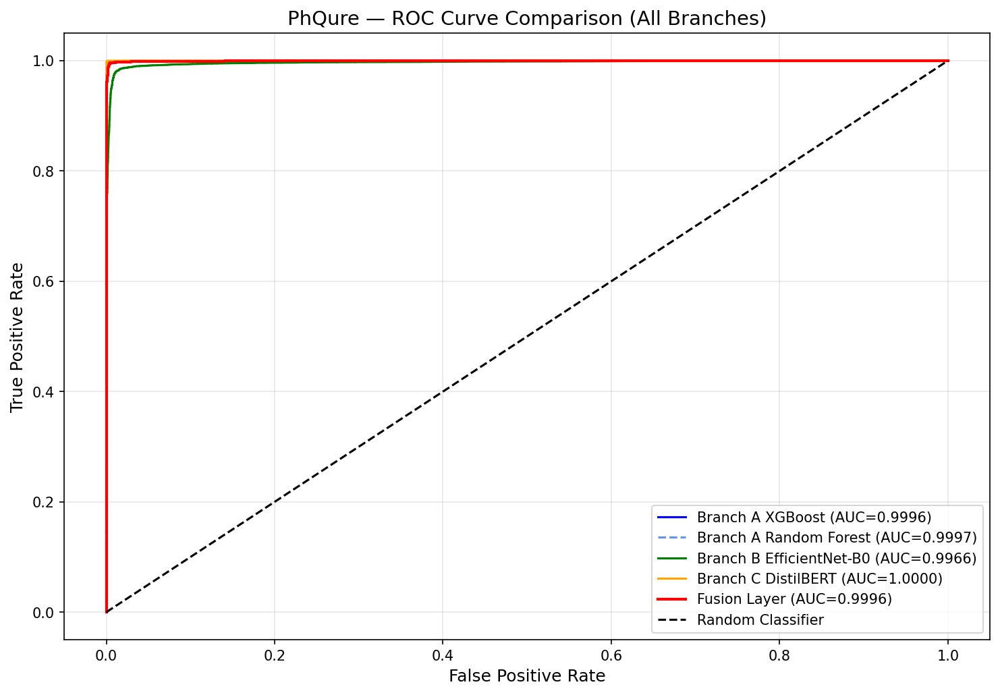

# PhQure — Phishing & Quishing Detection

A unified machine learning framework for detecting URL-based phishing and QR code phishing (quishing).

🔗 **Live Demo**: https://phqure-h3symxjfdv3xsdjbhpmc69.streamlit.app/

---

## Architecture

PhQure uses three independent detection branches combined via a fusion layer:

| Branch | Model | Input | Accuracy | AUC |
|--------|-------|-------|----------|-----|
| A | XGBoost + Random Forest | 29 URL features | 99.67% | 0.9997 |
| B | EfficientNet-B0 | QR code images | 92.77% | 0.9780 |
| C | DistilBERT | Raw URL text | 99.88% | 1.0000 |
| Fusion | Logistic Regression | Branch A + C probabilities | 99.65% | 0.9991 |

---

## Features

- **Branch A** — Extracts 29 handcrafted URL features (length, depth, special characters, suspicious words etc.) and trains XGBoost + Random Forest classifiers
- **Branch B** — Fine-tunes EfficientNet-B0 CNN on 30,000 QR code images to detect quishing
- **Branch C** — Fine-tunes DistilBERT on raw URL text to detect phishing patterns in URL structure
- **Fusion Layer** — Logistic Regression meta-learner combines Branch A and C probability scores
- **Explainability** — SHAP for URL branches, Grad-CAM for QR branch

---

## Project Structure

```
PhQure/
├── app.py                       # Streamlit app
├── requirements.txt             # Dependencies
├── models/
│   ├── branch_a_xgb.pkl        # XGBoost model
│   ├── branch_a_rf.pkl         # Random Forest model
│   └── fusion_meta_lr.pkl      # Fusion meta-learner
├── notebooks/
│   └── branch_a.ipynb          # Branch A training notebook
└── src/
    ├── extract_features.py          # URL feature extraction
    ├── extract_features_new.py      # Updated feature extraction
    └── retrain_branch_a.py          # Branch A retraining script
```

---

## Models

| Model | Location |
|-------|----------|
| Branch A (XGBoost) | `models/branch_a_xgb.pkl` |
| Branch A (Random Forest) | `models/branch_a_rf.pkl` |
| Branch B (EfficientNet-B0) | Google Drive |
| Branch C (DistilBERT) | [HuggingFace](https://huggingface.co/bishnoiavantika1/phqure-distilbert-branchc) |
| Fusion | `models/fusion_meta_lr.pkl` |

---
## ROC Curve



## Installation

```bash
git clone https://github.com/Avantika029/PhQure.git
cd PhQure
python -m venv venv
venv\Scripts\activate
pip install -r requirements.txt
streamlit run app.py
```

---

## Dataset

- **Branch A & C**: 100,000 URLs (50,000 phishing + 50,000 legitimate)
- **Branch B**: 30,018 QR code images (15,016 phishing + 15,002 legitimate)

---

## Explainability

- **SHAP** — identifies which URL features contributed most to the phishing prediction
- **Grad-CAM** — highlights which regions of a QR code image activated the phishing signal

---

## Tech Stack

- Python, PyTorch, HuggingFace Transformers
- XGBoost, Scikit-learn, SHAP
- Streamlit, Matplotlib
